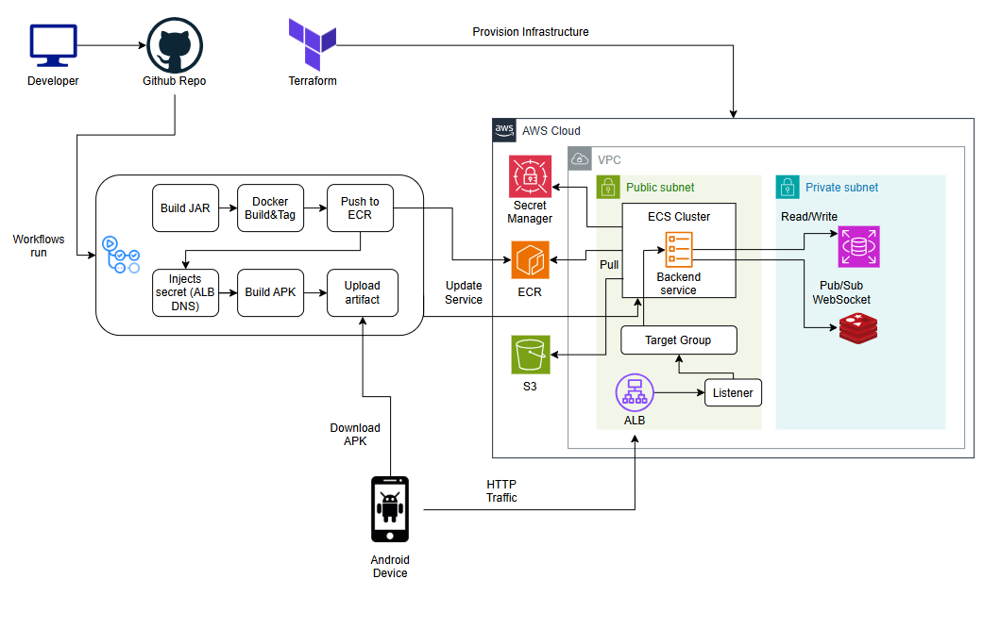

# CLOUD-NATIVE REAL-TIME CHAT PLATFORM

Hệ thống nhắn tin thời gian thực được xây dựng trên kiến trúc Cloud-Native, triển khai trên nền tảng AWS ECS Fargate với khả năng tự động mở rộng và tính sẵn sàng cao.

---

## KIẾN TRÚC HỆ THỐNG

Hệ thống được thiết kế theo mô hình Stateless Architecture, cho phép mở rộng theo chiều ngang (Horizontal Scaling) và đảm bảo tính ổn định cao thông qua các thành phần:
- Điều phối lưu lượng: Application Load Balancer (ALB) điều phối traffic đến các container instance.
- Tính toán: AWS ECS Fargate (Serverless Container Orchestration) vận hành backend Spring Boot.
- Đồng bộ thời gian thực: Redis Pub/Sub đồng bộ hóa tin nhắn WebSocket giữa nhiều server node.
- Lưu trữ: AWS S3 lưu trữ tệp tin và RDS PostgreSQL lưu trữ dữ liệu người dùng.

---

## CÔNG NGHỆ VÀ HẠ TẦNG

BACKEND SERVICE
- Framework: Spring Boot 3.x / Java 21
- Security: Custom JWT Authentication (Stateless)
- Real-time: WebSocket (STOMP) với Redis Relay
- Cloud Integration: AWS SDK v2 (S3, Secrets Manager)

MOBILE APPLICATION
- Nền tảng: Android (Kotlin / Jetpack Compose)
- Giao tiếp: Retrofit (REST API) và StompClient (WebSocket)

DEVOPS VÀ IAAC
- Infrastructure as Code: Terraform (Modular Design)
- Mạng lưới: Amazon VPC với Public/Private Subnets theo chuẩn bảo mật
- Khả năng mở rộng: AWS Application Auto Scaling (Target Tracking Policy)
- Quản lý bí mật: AWS Secrets Manager
- CI/CD: GitHub Actions (Tự động Build Docker, Push ECR và Deploy ECS)

---

## ĐẶC ĐIỂM KỸ THUẬT NỔI BẬT

1. DISTRIBUTED WEBSOCKETS
Sử dụng Redis làm message broker để giải quyết bài toán mất kết nối khi chạy trên môi trường đa server. Tin nhắn được phát tán đến tất cả các nodes trong cluster, đảm bảo mọi người dùng đều nhận được tin nhắn tức thì cho dù họ đang kết nối tới instance nào.

2. AUTO SCALING VÀ HIGH AVAILABILITY
Hệ thống tự động theo dõi mức độ sử dụng CPU của ECS Services và điều chỉnh số lượng container instance từ 1 đến 3 tasks. ALB thực hiện kiểm tra sức khỏe (Health Check) định kỳ và tự động loại bỏ các instance lỗi khỏi luồng traffic.

3. SECURE INFRASTRUCTURE
Toan bộ cơ sở dữ liệu (RDS) và cache (Redis) được đặt trong Private Subnets (mạng nội bộ). Việc truy cập được kiểm soát nghiêm ngặt thông qua các lớp Security Group, chỉ cho phép backend container kết nối đến các tài nguyên này.

---

## CẤU TRÚC DỰ ÁN

chatapp_backend/
- Mã nguồn Spring Boot, logic xử lý WebSocket và kết nối AWS Services.
- Dockerfile cấu hình cho việc đóng gói container.

chatapp_mobile/
- Ứng dụng Android Kotlin sử dụng Jetpack Compose.

terraform/
- modules/alb: Cấu hình Application Load Balancer và Target Groups.
- modules/ecs: Định nghĩa Cluster, Task Definition, Service và Auto Scaling.
- modules/rds: Khởi tạo AWS RDS PostgreSQL.
- modules/redis: Cấu hình ElastiCache Redis cho đồng bộ WebSocket.
- modules/vpc: Thiết lập mạng lưới VPC, Subnets và NAT Gateway.

.github/workflows/
- backend-cd.yml: Tự động build, push image lên ECR và deploy lên ECS.
- android-ci.yml: Tự động build file APK cho ứng dụng di động.

---

## HƯỚNG DẪN TRIỂN KHAI

1. KHỞI TẠO HẠ TẦNG (IAC)
Yêu cầu: Terraform và AWS CLI đã được cấu hình.
- cd terraform
- terraform init
- terraform apply

2. TRIỂN KHAI ỨNG DỤNG (CI/CD)
- Cấu hình GitHub Secrets: AWS_ACCESS_KEY_ID, AWS_SECRET_ACCESS_KEY.
- Push code lên nhánh main để kích hoạt pipeline tự động.
